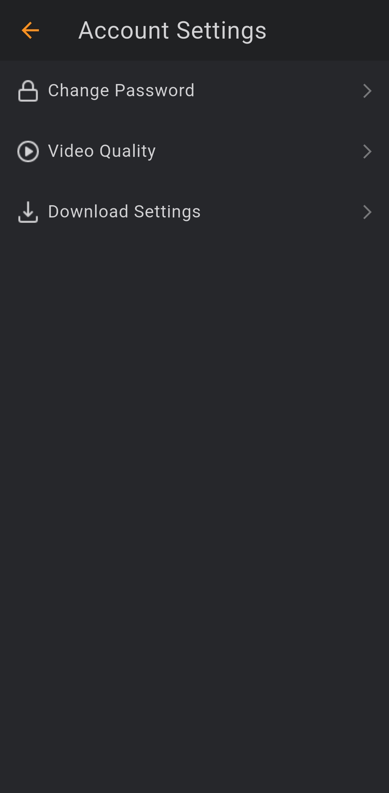

# Flix App – UI Demo

A stylish Flutter UI demo inspired by movie streaming apps like Netflix.  
This is a **UI-only** project focused on design and layout, without backend or dynamic content.

---

## 📱 Overview

The demo includes UI screens typically seen in movie and streaming apps:

- Home screen with featured movies
- Movie categories and genres
- Movie detail pages
- Cast, trailers, and watchlist previews

---

## 🔍 Status

**Demo only** – No backend integration or working functionality.

---

## 📸 Screenshots

<table>
  <tr>
    <td></td>
    <td></td>
    <td></td>
    <td></td>
  </tr>
  <tr>
    <td></td>
    <td></td>
    <td></td>
    <td></td>

  </tr>
  <tr>
    <td></td>
    <td></td>
    <td></td>
    <td></td>
  </tr>
</table>

---

## 📝 Notes

- Built entirely with Flutter
- Smooth and cinematic UI elements
- A solid starting point for any streaming or movie-based app

---

## ✍️ Created by

**Mohamed Ebrahim**
